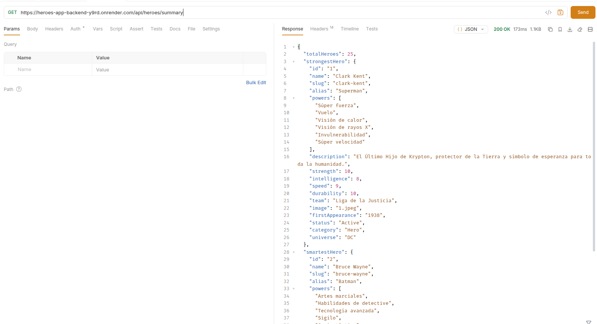
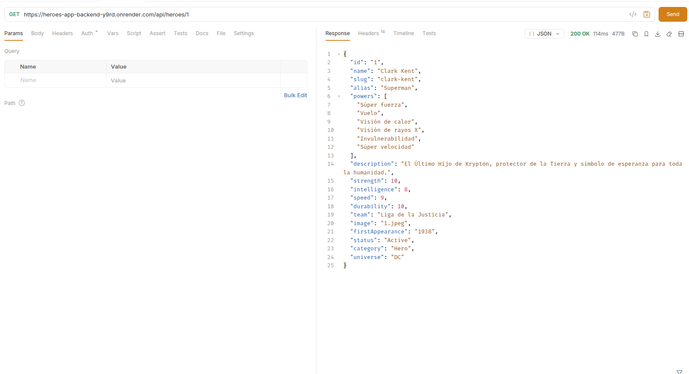

# Heroes App — Backend 🛡️

RESTful API for managing superheroes and villains, built with NestJS 11 and TypeScript. Provides CRUD operations, paginated listings, dashboard summaries, and advanced multi-filter search — all consumed by the [Heroes App frontend](https://github.com/lgabriel97/heroes-app-frontend).

🔗 **API Base URL:** `https://heroes-app-backend-y9rd.onrender.com/api`
🌐 **Frontend Demo:** [heroes-app.netlify.app](https://deft-truffle-8f9465.netlify.app/)

---

## Screenshots

| Heroes Summary | Hero Details |
| --- | --- |
|  |  |


---

## Tech Stack

| Layer | Technology |
| --- | --- |
| Framework | [NestJS 11](https://nestjs.com/) |
| Language | [TypeScript 5](https://www.typescriptlang.org/) |
| Validation | [class-validator](https://github.com/typestack/class-validator) + [class-transformer](https://github.com/typestack/class-transformer) |
| ID Generation | [uuid](https://github.com/uuidjs/uuid) |
| Static Files | [@nestjs/serve-static](https://docs.nestjs.com/recipes/serve-static) |
| Testing | [Jest](https://jestjs.io/) + [Supertest](https://github.com/ladakh/supertest) |
| Hosting | [Render](https://render.com/) |

---

## API Endpoints

All endpoints are prefixed with `/api`. CORS is enabled globally.

### Heroes CRUD

| Method | Endpoint | Description |
| --- | --- | --- |
| `GET` | `/api/heroes` | List all heroes (paginated) |
| `GET` | `/api/heroes/summary` | Dashboard summary (totals, strongest, smartest) |
| `GET` | `/api/heroes/search` | Advanced search with multiple filters |
| `GET` | `/api/heroes/:id` | Get a hero by ID or slug |
| `POST` | `/api/heroes` | Create a new hero |
| `PATCH` | `/api/heroes/:id` | Update a hero |
| `DELETE` | `/api/heroes/:id` | Delete a hero |

### Query Parameters

**`GET /api/heroes`** — Paginated listing:

| Param | Type | Default | Description |
| --- | --- | --- | --- |
| `limit` | number | `6` | Items per page |
| `offset` | number | `0` | Number of items to skip |
| `category` | string | `all` | Filter by category (`Hero`, `Villain`, or `all`) |

**`GET /api/heroes/search`** — Advanced search (at least one param required):

| Param | Type | Description |
| --- | --- | --- |
| `name` | string | Search by name or alias (partial match) |
| `team` | string | Filter by team |
| `category` | string | Filter by category |
| `universe` | string | Filter by universe |
| `status` | string | Filter by status |
| `strength` | number | Minimum strength value |

### Hero Entity

```json
{
  "id": "1",
  "name": "Spider-Man",
  "slug": "spider-man",
  "alias": "Peter Parker",
  "powers": ["Wall-Crawling", "Spider-Sense", "Web-Shooting"],
  "description": "...",
  "strength": 70,
  "intelligence": 85,
  "speed": 80,
  "durability": 75,
  "team": "Avengers",
  "image": "https://...",
  "firstAppearance": "Amazing Fantasy #15",
  "status": "Active",
  "category": "Hero",
  "universe": "Marvel"
}
```

### Response Examples

**`GET /api/heroes?limit=2`**

```json
{
  "total": 30,
  "pages": 15,
  "heroes": [
    { "id": "1", "name": "Spider-Man", "slug": "spider-man", "..." },
    { "id": "2", "name": "Batman", "slug": "batman", "..." }
  ]
}
```

**`GET /api/heroes/summary`**

```json
{
  "totalHeroes": 30,
  "strongestHero": { "name": "...", "strength": 100, "..." },
  "smartestHero": { "name": "...", "intelligence": 100, "..." },
  "heroCount": 18,
  "villainCount": 12
}
```

---

## Validation

The API uses `ValidationPipe` globally with:

- **whitelist** — strips unknown properties from the request body
- **forbidNonWhitelisted** — rejects requests with unknown properties
- **transform** — auto-transforms query params to their declared types (implicit conversion enabled)

---

## Getting Started

### Prerequisites

- Node.js >= 18
- npm >= 9

### Installation

```bash
git clone https://github.com/lgabriel97/heroes-app-backend.git
cd heroes-app-backend
npm install
```

### Run in development

```bash
npm run start:dev
```

The API will be available at `http://localhost:3000/api`.

### Build and run for production

```bash
npm run build
npm run start:prod
```

### Run tests

```bash
npm run test          # Unit tests
npm run test:e2e      # End-to-end tests
npm run test:cov      # Test coverage
```

---

## Project Structure

```
src/
├── common/
│   └── dto/
│       └── pagination.dto.ts         # Reusable pagination DTO (limit, offset, category)
├── data/
│   └── heroes.data.ts                # Pre-loaded heroes dataset
├── heroes/
│   ├── dto/
│   │   ├── create-hero.dto.ts        # Validated create payload (all fields required)
│   │   ├── update-hero.dto.ts        # Partial update (PartialType of CreateHeroDto)
│   │   └── advande-search.dto.ts     # Advanced search filters (all optional)
│   ├── entities/
│   │   └── hero.entity.ts            # Hero type definition (16 fields)
│   ├── heroes.controller.ts          # 7 route handlers
│   ├── heroes.module.ts              # Module declaration
│   └── heroes.service.ts             # Business logic (CRUD + search + summary)
├── app.module.ts                     # Root module (ServeStatic + HeroesModule)
└── main.ts                           # Bootstrap, CORS, global prefix /api, ValidationPipe
```

---

## Deployment

The API is deployed on **Render** (free tier) with automatic deploys from `main`.

| Setting | Value |
| --- | --- |
| Build Command | `npm install && npm run build` |
| Start Command | `npm run start:prod` |
| Port | `process.env.PORT` (auto-assigned by Render) |

> **Note:** On Render's free tier, the service sleeps after 15 minutes of inactivity. The first request after sleeping takes ~30 seconds. Data is stored in-memory and resets on each restart.

---

## Architecture

```
┌─────────────────┐        HTTP        ┌──────────────────────┐
│                 │  ───────────────►  │                      │
│   React SPA     │   GET/POST/PATCH   │   NestJS REST API    │
│   (Netlify)     │   DELETE /api/*    │   (Render)           │
│                 │  ◄───────────────  │                      │
└─────────────────┘        JSON        └──────────┬───────────┘
                                                  │
                                                  ▼
                                          ┌──────────────┐
                                          │  In-Memory   │
                                          │  Data Store  │
                                          │  (heroes.    │
                                          │   data.ts)   │
                                          └──────────────┘
```

---

## Related

- [heroes-app-frontend](https://github.com/lgabriel97/heroes-app-frontend) — React 19 SPA that consumes this API

---

## License

This project is unlicensed — feel free to use it as reference.